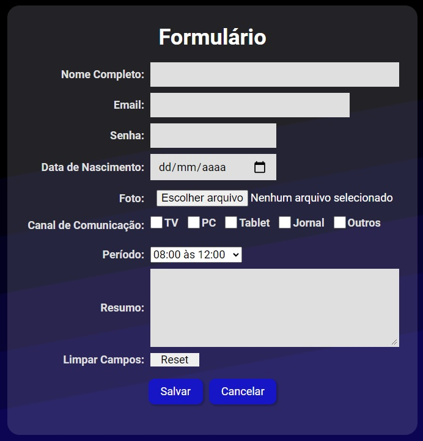

# Form Project

College project where the creation of a form was requested.

## 🔧 functions

### Function 01:
- Validation of the "Full Name" field.

### Function 02:
- Validation of the "Email" field.

### Function 03:
- Validation of the "Password" field.

### Function 04:
- Validation of the "Birth Date" field.

## See project development:

To see the project go to the link:
<a href="https://marioelvio.com/portfolio/faculdade/1/" target="_blank">click here!</a>

### Contact

Copyright © 2022 Mario Elvio

